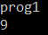
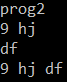
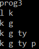
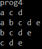
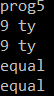

1	СПЕЦИФИКАЦИЯ РАЗРАБОТАННОГО ЯЗЫКА ПРОГРАММИРОВАНИЯ.

Разработанный язык программирования:
•	Язык: язык для работы с множествами 

•	Объявление переменных: явное

•	Оператор присваивания: одноцелевой, например, a = b

•	Структуры, ограничивающие область видимости: подпрограммы и блочные операторы

•	Маркер блочного оператора: явный, { и }

•	Условные операторы: многовариантный оператор if () {} else {}

•	Операторы цикла: оператор while

•	Перегрузка подпрограмм: отсутствует

•	Передача параметров в подпрограмму: только по значению и возвращаемому значению

•	Допустимое место объявления подпрограмм: в любом месте программы, также и внутри другой подпрограммы.

•	Встроенные функции

•	Встроенные типы

•	Целевой код: байт-код JVM, формат промежуточного кода – язык Java, генерация целевого кода стандартным компилятором (javac)

 
2	СИНТАКСИС РАЗРАБОТАННОГО ЯЗЫКА ПРОГРАММИРОВАНИЯ.
Разработанный язык программирования предназначен для работы с множествами. Программа содержит главную функцию, которая имеет вид:

main
{
	//тело программы
}

Тело программы может содержать встроенные функции, условные операторы, циклические операторы, вызовы функций, объявление переменных и операции над переменными.
После главной программы идёт описание пользовательских функций.

2.1 СИНТАКСИС ОБЪЯВЛЕНИЯ ПЕРЕМЕННЫХ

Разработанный язык определяет 2 элементарных типа данных: element, set. Поддерживается явное объявление переменных. Основная форма объявления переменных выглядит следующим образом.
	
	тип идентификатор = значение; 

Здесь: тип — это один из элементарных типов языка; идентификатор — это имя переменной; значение — имя объявленной переменной такого же типа, вызов пользовательской или встроенной функции, возвращающей такой же тип, либо специфично для каждого типа: set – множество, содержащее переменные и записанное следующим образом: {element1, element2, …, elementN}, element – строка заключенная в двойные кавычки(“строка”).

2.2 СИНТАКСИС ОБЪЯВЛЕНИЯ ПОЛЬЗОВАТЕЛЬСКИХ ФУНКЦИЙ

Общая форма объявления функции выглядит следующим образом.

    function возвращаемый_тип имя (список_параметров) {
	// тело функции
	return возвращаемая_переменная;
    }

Здесь возвращаемый_тип указывает тип данных, возвращаемый функцией. Он может быть любым допустимым типом данного языка. Если подпрограмма не возвращает значение, то возвращаемый_тип в объявлении функции не будет указан и команда return ничего не возвращает (функция будет типа void). Имя служит для указания имени подпрограммы. Cписок_параметров - последовательность переменных с указание их типа (''тип идентификатор''), разделенных запятыми. Если функция не имеет параметров, список параметров будет пустым.
Функции, кроме функций, не имеющих возвращаемого значения, возвращают значение вызывающей процедуре с помощью формы оператора return.
	return идентификатор;
Здесь возвращаемая_переменная — это имя переменной, содержащей возвращаемое значение.

2.3 СИНТАКСИС ОПЕРАЦИЙ НАД ДАННЫМИ
Язык имеет набор встроенных операций для работы с данными:
•	Объединение множеств: set+set

•	Пересечение(произведение) множеств: set*set

•	Разность множеств (из множества, стоящего слева, вычитается множество, стоящее справа): set-set

•	Симметрическая разность множеств: set/set

•	Добавление элемента в множество, если его там нет: set+element, element+set

•	Удаление элемента из множества, если он там есть: set-element

•	Пересечение множества с элементом, то есть результатом является элемент, участвующий в операции, если он есть в множестве, иначе пустое множество: set*element, element*set

•	Проверка равенства и неравенства множеств: set==set, set!=set

•	Проверка равенства и неравенства элементов: element==element, element!=element

2.4	 СИНТАКСИС УПРАВЛЯЮЩИХ КОНСТРУКЦИЙ
Условные операторы
Структуру условного оператора if else выглядит следующим образом:
    
    if(условие){
    	// тело_1
    } else{
    //тело_2
    }
    
Здесь условие содержить некоторое логическое выражение. тело_1 выполняется в случае верного условия, тело_2 – в случае ложности выражения. Тело может содержать встроенные функции, условные операторы, циклические операторы, вызовы функций, объявление переменных и операции над переменными.
	Циклы:
Цикл while:
    
    while (условие) {
	    //тело
    }
    
Здесь условие и тело имеет такое же определение, как и в условном операторе.

2.5	СИНТАКСИС И ОПИСАНИЕ ВСТРОЕННЫХ ФУНКЦИЙ

Функция print()
Данная функция может быть вызвана из тела основной программы или пользовательской функции. Её синтаксис: print(строка). Здесь строка определяется как набор символов, заключённых в кавычки. Данная функция выводит на экран переданную строку.

Функция printSet()
Данная функция может быть вызвана из тела основной программы или пользовательской функции. Её синтаксис: printSet(set/element). Данная функция выводит на экран элементы множества, если параметром является множество, и значение элемента, если параметром является элемент.

Функция size()
Синтаксис: set.size(). Функция возвращает количество элементов множества set, используется для составления логических выражения для условных и циклических операторов.

Функция get()
Синтаксис: set.size(number). Функция возвращает элемент под номером number в множестве set. Может использоваться для объявления элемента.

Функция indexOf()
Синтаксис: set.indexOf(element). Функция используется в условных операторах и возвращает истину, если element присутствует в set, иначе – ложь.

3 ОПИСАНИЕ ДОПОЛНИТЕЛЬНО РАЗРАБОТАННЫХ КЛАССОВ.
Дополнительно разработанные классы:

    Element — класс для работы с элементами, хранит его значение.

    Set – класс для работы с множествами, хранит список всех элементов, а также содержит некоторые методы для работы с множеством: добавление, удаление, проверка присутствия элемента во множестве.

Также были разработаны следующие функции для работы с множествами и элементами: объединение множеств, пересечение множеств, разность множеств, симметрическая разность множеств, добавление элемента в множество, удаление элемента из множества, пересечение множества с элементом, проверка равенства и неравенства множеств, проверка равенства и неравенства элементов.
 
4 ПЕРЕЧЕНЬ ГЕНЕРИРУЕМЫХ ОШИБОК
Variable NAME already used – объявление переменной NAME невозможно, переменная уже объявлена раньше.

Variable NAME is not set – попытка присвоить множеству значение элемент

Variable NAME is not element – попытка присвоить элементу значение множество

Function NAME return not set – попытка присвоить множеству значение, не являющееся множеством, так как функция возвращает не множество

Function NAME return not element - попытка присвоить элементу значение, не являющееся элементом, так как функция возвращает не элемент

Can’t find variable NAME – переменная не объявлена

Variable NAME1 is element and NAME2 is set – попытка выполнения операции с некорректными типами (пример: element-set, разность между элементом и множеством)

Function NAME already used – имя функции уже использовано

Can’t find variable NAME at return – переменная, возвращаемая функцией, не объявлена

Can’t find function NAME – не удалось найти реализацию функции

Can’t find such arguments in function NAME – неверные аргументы вызываемой функции.

 
5 ПРИМЕРЫ РАБОТЫ КОМПИЛЯТОРА

Тест 1

Исходный код программы:

    main{
    print("prog1")
    element l = "9"
    set h = {l}
    print(h)
    }
    
Результат выполнения программы:

Тест 2

Исходный код программы:

    main{
    print("prog2")
    element l = "9"
    element k = "hj"
    set h = {l, k}
    print(h)
    element a = qwerty()
    print(a)
    h=h+a
    print(h)
    }
    function element qwerty(){
    element a = "df"
    return a
    }

Результат выполнения программы:

 

Тест 3

Исходный код программы:

    main{
    print("prog3")
    element l = "l"
    element k = "k"
    element g = "g"
    set ree = {l, k}
    print(ree)
    if(ree.indexOf(l)){
    ree=ree-l
    }
    if(ree.indexOf(g)){
    ree=ree-g
    }
    else {
    ree=ree+g
    }
    print(ree)
    element p = "p"
    element ty = "ty"
    qwerty(ree, ty)
    qwerty(ree, p)
    }
    function qwerty(set f, element a){
    set b = f + a
    print(b)
    }
    
Результат выполнения программы:
 

Тест 4

Исходный код программы:

    main{
    print("prog4")
    element a = "a"
    element b = "b"
    element c = "c"
    element d = "d"
    element e = "e"
    set set1 = {a, c, d}
    set set2 = {a, b, c, d, e}
    print(set1)
    print(set2)
    while(set1.size()<set2.size()){
        element temp = is(set2)
        set2 = set2 - temp
        print(set2)
    }
    }
    function element is(set a){
        element temp = a.get(0)
        return temp
    }
    
Результат выполнения программы:
 

Тест 5

Исходный код программы:

    main{
    print("prog5")
    element l = "9"
    element ty = "ty"
    set h = {l, ty}
    print(h)
    set var = {l, ty}
    print(var)
    if(h==var){
    print("equal")
    }
    else {print("non equal")}
    if(h!=var){
    print("non equal")
    }
    else {print("equal")}
    }
    function qwerty(set f, element a){
    set b = f + a
    print(b)
    }
    
Результат выполнения программы:

 

